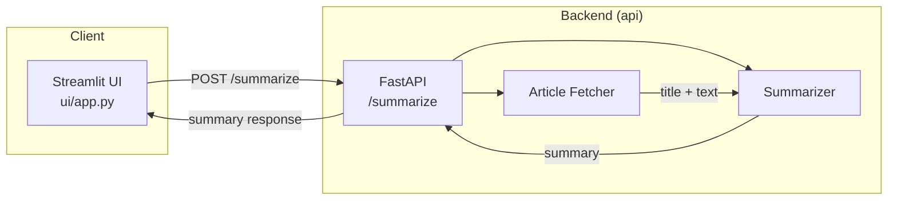

# News Summarizer

A small project that fetches online news articles and generates concise summaries using `LangChain` + `OpenAI` (via `langchain_openai`). It includes a FastAPI backend that fetches and parses articles, a summarizer component that runs a prompt/chain against an LLM, and a simple Streamlit UI that calls the backend.

**Note on web scraping**

This project uses web scraping (via `newspaper3k` library) to download and parse article content. Web scraping can have legal, ethical, and technical implications. Check the target site's terms of service, robots.txt, and applicable laws before scraping. Be mindful of copyright, rate limits, and polite crawling (respectful request rates and caching). For production use, prefer official APIs where available.

**Why this project is useful**

The example demonstrates how raw web content is transformed into structured input for an LLM and why a robust summarizer matters. It handles noisy, long, and varied article text, reduces irrelevant content, and produces concise, actionable summaries that are easier to consume and integrate into downstream workflows.

## Project overview

This project demonstrates an end-to-end flow for summarizing news articles:

- A `Streamlit UI` takes a news article URL and calls the backend endpoint `POST /summarize`.
- The `FastAPI backend` fetches the article (using `newspaper3k` library), extracts title and text, then calls a `LangChain + ChatOpenAI` LLM call to produce a bulleted summary.
- The summary is returned to the UI and shown to the user.

This is intended as a small, extensible example rather than a production-ready service.

## Architecture & flow



## Quickstart (local)

Prerequisites:

- Python 3.10+ recommended
- Create a virtual environment for backend and/or UI
- Ensure dependencies are installed (see notes)

Install dependencies:

This project uses the `uv` package manager by default. If you don't have `uv` installed, install it in your local environment.

Reference: https://docs.astral.sh/uv/getting-started/installation/

To run frontend (UI) or backend (API), go to the respective folders and run the command: `uv sync` or `uv install`

Run backend:

```shell
cd 1-news-summarizer/api
uv sync
uv run fastapi dev main.py
```

The endpoint will be available at `http://localhost:8000/summarize` and docs at `http://localhost:8000/docs`.

Run UI:

```shell
cd 1-news-summarizer/ui
uv sync
uv run streamlit run app.py
```

## Environment variables

The backend reads configuration via pydantic settings and an `.env` file.

Required environment variables: `OPENAI_API_KEY`, `LOG_LEVEL (optional; defaults to INFO)`

Rename `.env.example` to `.env` `/api/.env` and add your own API key.

```.env
OPENAI_API_KEY=sk-...
LOG_LEVEL=INFO
```
